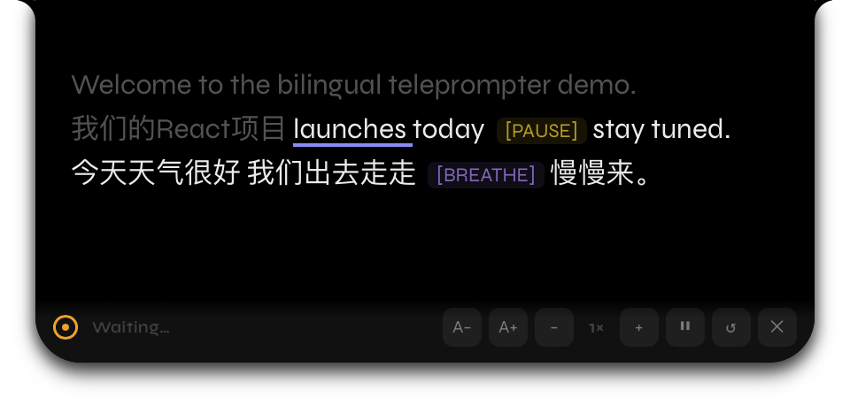
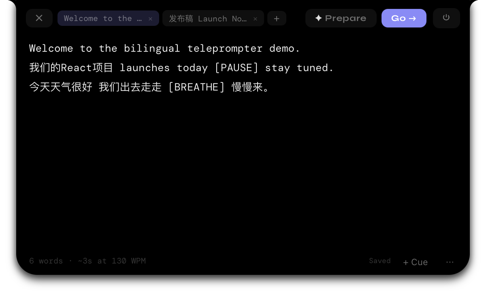
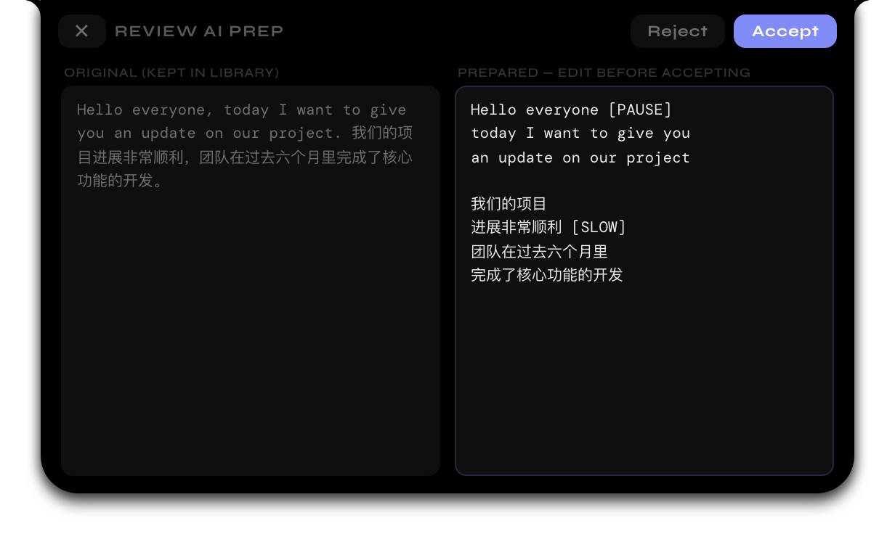

# Bilingual AI Teleprompter

A free, open source voice-activated teleprompter for **macOS**.

**Speak → it scrolls. Stop → it pauses. No subscriptions. No cloud. No accounts.**

---

## Attribution

This project is based on [openTeleprompt](https://github.com/ArunNGun/openTeleprompt) by [ArunNGun](https://github.com/ArunNGun), released under the [MIT License](https://github.com/ArunNGun/openTeleprompt#license). All credit for the original teleprompter — the voice-activated scrolling engine, Dynamic Island / Classic overlay modes, rich text editor, script library, and the rest of the upstream feature set — belongs to the upstream author. The full upstream commit history is preserved in this repository.

This fork extends the original project with:

- **Word-level speech tracking (English + Mandarin)** — on-device speech recognition follows your actual reading position: spoken text dims, the current word is highlighted, and the scroll is driven by where you are in the script, broadcast-teleprompter style. Mixed Chinese–English scripts are handled. See [Word Tracking](#word-tracking-this-fork).
- **AI script preparation** — an optional "Prepare for Prompter" action rewrites a raw script (email draft, essay, speech — English or Chinese) into teleprompter-friendly form: short lines, spoken phrasing, and `[PAUSE]`/`[SLOW]`/`[BREATHE]` cue markers. See [Prepare with AI](#prepare-with-ai-this-fork).

See [NOTICE](NOTICE) for license and provenance details. Upstream repository: https://github.com/ArunNGun/openTeleprompt

---

## Screenshots

<p align="center"></p>
<p align="center"><em>The notch pill — hover reveals the editor chevron and the quit control.</em></p>

<p align="center"></p>
<p align="center"><em>Word tracking on a mixed 中文/English script: spoken text dims, the current word is underlined, cue markers pause for you.</em></p>

<p align="center"></p>
<p align="center"><em>The script editor: script tabs, ✦ Prepare, and Go in one row — edits autosave, cue markers and formatting live in the footer menus.</em></p>

<p align="center"></p>
<p align="center"><em>Prepare with AI: side-by-side review before anything replaces your script.</em></p>

---

## Download — v1.1.0 (this fork)

| Platform | Link | Notes |
|---|---|---|
| 🍎 Apple Silicon (M1–M4) | [Download .dmg](https://github.com/JackyJiang08/bilingual-ai-teleprompter/releases/latest) | macOS 13+ |
| 🍎 Intel Mac | [Download .dmg](https://github.com/JackyJiang08/bilingual-ai-teleprompter/releases/latest) | macOS 13+ |

This fork is **macOS only** (the speech-tracking sidecar uses Apple's Speech framework). For Windows, see the upstream [openTeleprompt releases](https://github.com/ArunNGun/openTeleprompt/releases).

---

## Features

- 🏝️ **Dynamic Island mode** — real concave corners, Apple spring physics, pixel-perfect notch fit
- 🖥️ **Classic mode** — draggable floating pill, works on any Mac (notch or not)
- 🎙️ **Voice-activated scroll** — frequency analysis (85–3400 Hz), not just volume. Only your voice triggers it
- 📝 **Distraction-free editor** — script tabs, ✦ Prepare, and Go in a single header row; bold/color and cue markers `[PAUSE]` `[SLOW]` `[BREATHE]` in compact footer menus
- 📚 **Script library** — switch scripts from the header tabs; edits autosave (⌘S also works)
- 🎯 **Script-biased recognition** *(macOS 14+)* — word tracking builds an on-device language model from your script, measurably improving recognition of names and technical terms (see [Word Tracking](#word-tracking-this-fork))
- 🔇 **Invisible during screen share** — Zoom, Meet, Loom can't see it. Only you can
- 🌗 **Light & dark theme** — pastel light default, toggleable
- ⚡ **Live controls** — speed + font size adjustable while reading
- 🌫️ **Opacity control** — barely-there to solid
- ⌨️ **Global shortcuts** — ⌘⇧Space, ⌘⇧↑↓, ⌘⇧R, ⌘⇧E (open editor); ⌘S saves in the editor

---

## Word Tracking (this fork)

Instead of scrolling at a fixed speed whenever it hears sound, the prompter can recognize **what** you say and follow your reading position word by word:

- **Highlights your current word** (accent underline) and **dims what you've already spoken**; upcoming text stays at full brightness.
- **Scroll follows you** — the current word is eased toward a reading line at ~35% of the viewport. Speed up, slow down, skip a phrase, or stumble: the cursor tolerates skipped words, fillers, and misreads, and never jumps backward.
- **English and Mandarin** — pick the language in Settings → Word Tracking (English / 中文). Chinese scripts are tracked per character, so no spaces are needed; mixed Chinese–English scripts work, including Latin words embedded in Chinese text (e.g. 我们的React项目).
- **100% on-device** — recognition uses Apple's Speech framework with `requiresOnDeviceRecognition`. No audio or transcripts ever leave your Mac. macOS will ask once for Speech Recognition permission (plus the existing microphone permission).
- **Script-biased recognition (macOS 14+)** — at the start of each reading session the app builds a customized on-device language model from your script (cached per script, rebuilt on edit), biasing recognition toward the exact words on screen. On a jargon-heavy test sentence this raised words recognized from 10/18 to 13/18 and cut p90 word-to-recognition latency from 1428 ms to 792 ms; common-vocabulary text is unaffected. On older systems or unsupported locales the stock model is used, silently. Display-side responsiveness is also tuned so the highlight keeps up with your voice: the scroll-easing time constant dropped from ~280 ms to ~100 ms and the spoken-word fade from 300 ms to 150 ms. Measurement methodology and full numbers: [docs/ARCHITECTURE.md](docs/ARCHITECTURE.md) §3.3.
- **Graceful fallback** — if Speech permission is denied or the on-device model for the selected language isn't installed (System Settings › Keyboard › Dictation), the app falls back to the original frequency-based voice activation and says so in Settings. A clear script/language mismatch (an English script with 中文 tracking selected, or vice versa) is flagged in the reading view and Settings. You can also turn Word Tracking off entirely.

Under the hood: a small Swift sidecar streams on-device partial transcripts to the app, and a forward-searching matcher aligns them against the tokenized script. Details in [docs/ARCHITECTURE.md](docs/ARCHITECTURE.md) §3.1.

---

## Prepare with AI (this fork)

Paste a long raw script — an email draft, an essay, a speech, in English or Chinese — and click **✦ Prepare** in the script editor. The app asks an LLM to rewrite it into teleprompter-friendly form:

- **Short lines** sized for the narrow notch panel, with natural spoken phrasing. Chinese lines break at prosodic boundaries, never mid-phrase.
- **Cue markers** (`[PAUSE]` / `[SLOW]` / `[BREATHE]`) inserted sparingly at rhetorically appropriate points, using the app's existing marker convention.
- **You stay in control** — the result appears in a side-by-side review (original vs prepared). Edit the prepared text, then Accept or Reject. Accepting saves your original script to the library first, so it is never silently overwritten.

Two providers, selectable in Settings → Prepare with AI:

- **Claude API** — bring your own Anthropic API key ([console.anthropic.com](https://console.anthropic.com)). The key is stored in the **macOS Keychain**, never in plaintext config files or this repo. Model defaults to `claude-opus-5`.
- **Local (offline)** — any OpenAI-compatible endpoint, e.g. [Ollama](https://ollama.com) (`ollama serve`, set the model name in settings). Nothing leaves your machine.

The feature is fully optional and off by default: with no provider configured the app behaves exactly as before, and the Prepare button just opens settings with setup instructions. AI calls happen **only** when you click Prepare — never automatically.

---

## Versioning & upstream history (openTeleprompt)

This fork is versioned from **v1.0.0**; see [CHANGELOG.md](CHANGELOG.md) for what is inherited vs. new. The base is upstream **openTeleprompt v3.0.0** (Dynamic Island redesign, React/Tauri architecture); earlier upstream releases (v2.x Tauri rewrite and Windows support, v1.x Electron) are documented in the [upstream repository](https://github.com/ArunNGun/openTeleprompt), whose full commit history is preserved here.

---

## Project Structure

```
bilingual-ai-teleprompter/
├── src-tauri/          ← Rust backend
│   ├── src/lib.rs      ← All Tauri commands
│   ├── sidecar/        ← Swift speech-recognition sidecar
│   └── tauri.conf.json
├── src/                ← React + Vite frontend
│   ├── views/          ← Idle / Edit / Read / Settings views
│   ├── lib/            ← tokenizer, matcher, speech, AI modules (+ tests)
│   └── store/          ← Zustand store
├── index.html          ← Vite entry point (prompter)
├── settings.html       ← Settings panel entry
├── scripts/            ← sidecar build + visual snapshot tool
├── .github/workflows/  ← CI — builds macOS DMGs on release tag
└── docs/               ← ARCHITECTURE.md + README screenshots
```

---

## Development

```bash
# Install dependencies
npm install

# Dev mode (hot reload)
npm run dev

# Production build (macOS)
npm run build
```

**Requirements:** Rust + Cargo, Node.js 18+, Swift toolchain (Xcode Command Line Tools) for the speech sidecar — built automatically by `npm run build:sidecar` (invoked from `beforeDevCommand`/`beforeBuildCommand`). Unit tests for the tokenizer/matcher: `npm test`.

---

## First Launch

Releases are **not code-signed or notarized** (no Apple Developer certificate), so macOS Gatekeeper will block the app. Two known hurdles, both one-time:

**1. "App is damaged and can't be opened."** It isn't damaged — this is what Gatekeeper says about unsigned apps downloaded from the internet. Strip the quarantine flag:

```bash
xattr -cr "/Applications/Bilingual AI Teleprompter.app"
```

(Alternatively, right-click the app → **Open** → **Open** works on some macOS versions.)

**2. Permission prompts.** On the first reading session, macOS asks for **Microphone** and **Speech Recognition** access — both power the on-device word tracking; no audio or transcripts leave your Mac. If you decline, the app falls back to volume-based scrolling; re-enable later in System Settings → Privacy & Security. For Mandarin tracking, the Chinese dictation model must be installed (System Settings → Keyboard → Dictation).

If you build from source (`npm run build`), the app is ad-hoc signed and launches without the `xattr` step on the machine that built it.

---

## Contributing

PRs welcome! See [CONTRIBUTING.md](CONTRIBUTING.md).

---

## License

MIT — free forever.

This is a fork of [openTeleprompt](https://github.com/ArunNGun/openTeleprompt) by ArunNGun, which declares the MIT License in its README. See [NOTICE](NOTICE) for details.
